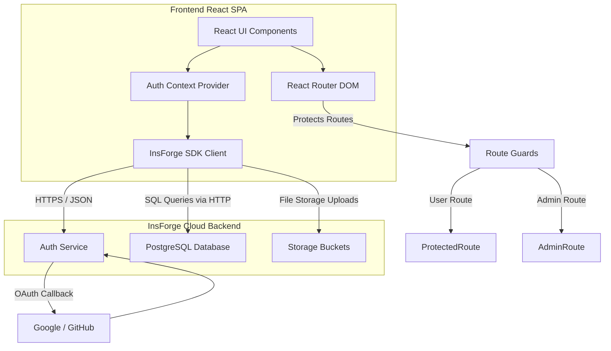
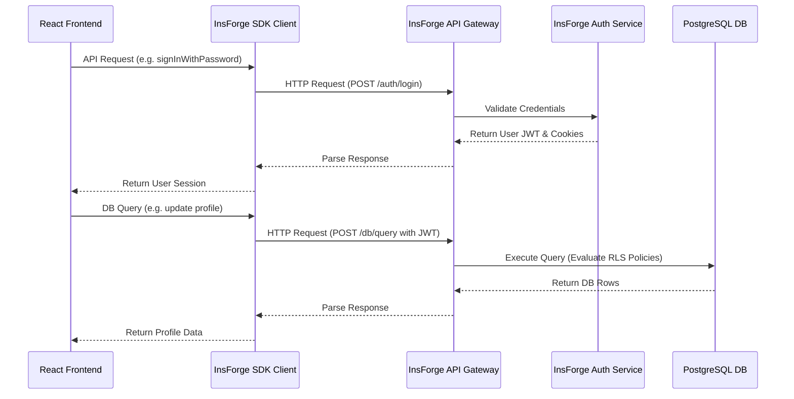
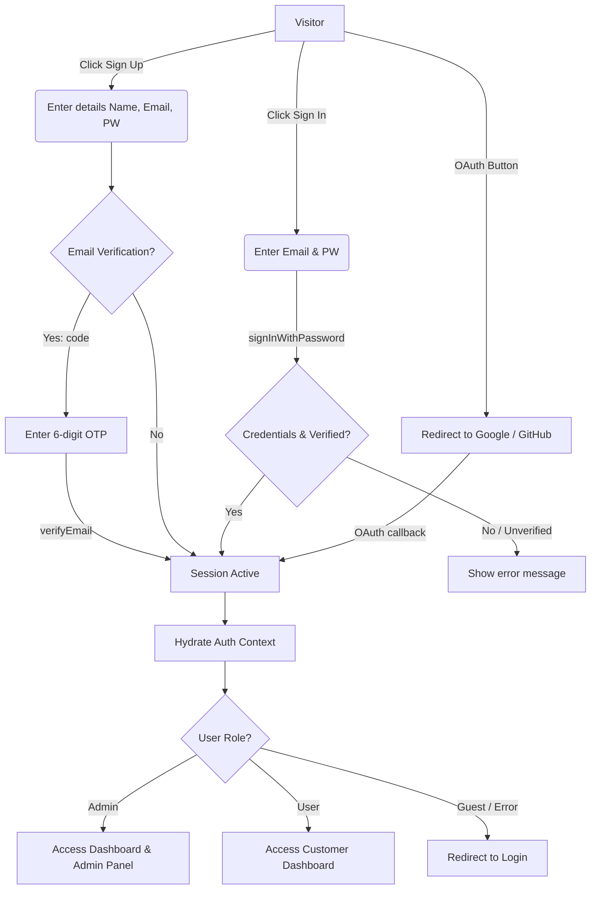
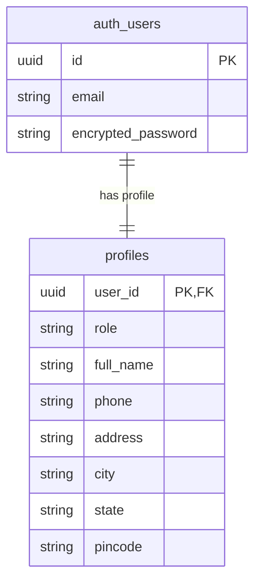
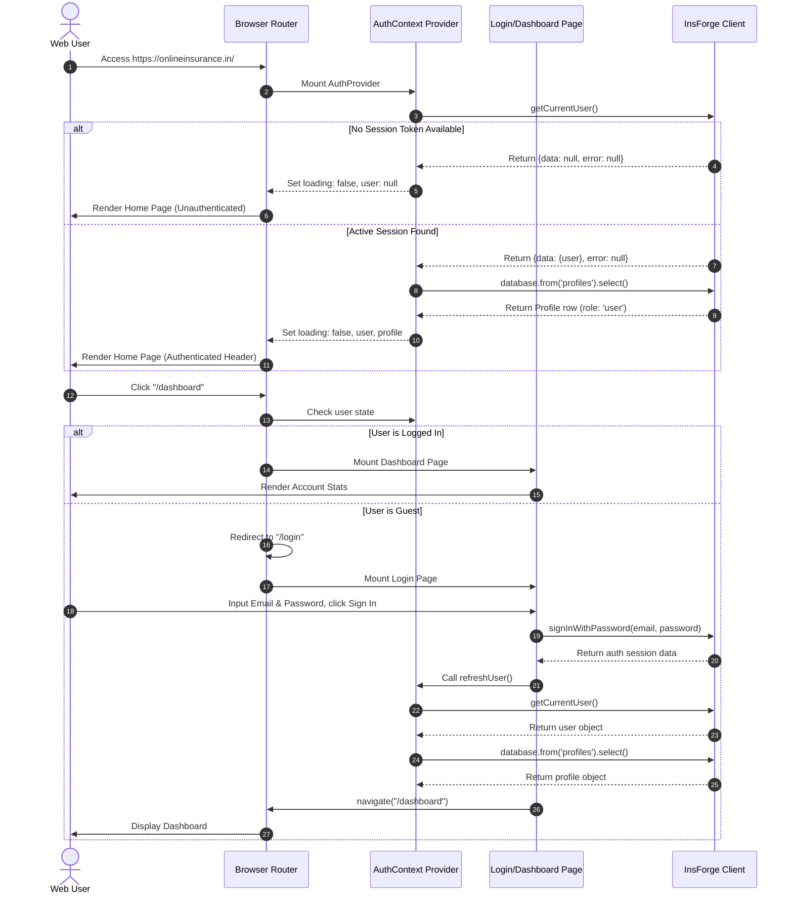

# Project Documentation

## 1. Project Overview

### Project Name
* **OnlineInsurance** (Internal Backend Project: `insurance1`)

### Purpose of the Application
The **OnlineInsurance** application is a premium, modern, and user-friendly insurance portal designed for the Indian market. It simplifies the process of finding, comparing, calculating, buying, and managing various insurance policies (Health, Life, Motor, Travel, Home, and Business). Leveraging an AI-assisted underwriting risk/premium calculator and a recommendation survey engine, it helps users secure optimal insurance coverage. It also includes digital document verification (KYC) and a claim submission system.

### Main Features
* **AI Premium Calculator & Risk Profiler**: Custom underwriting tool that estimates risk-adjusted quotes using parameters like age, lifestyle details, vehicle value, or travel duration.
* **AI Policy Recommender Survey**: A multi-step questionnaire that analyzes demographics, family size, goals, and lifestyle risks to recommend specific plans with match scores.
* **Plan Comparison Matrix**: Side-by-side comparison of plan premiums, benefits, coverages, and exclusions.
* **Granular Policy Purchase**: Comprehensive buy-flow for policies including nominee declarations.
* **Claim Submission & Tracking**: Digitized process allowing users to input incident details, estimate claim amounts, upload supporting files, and track resolution states.
* **KYC / Document Verification**: Section where users can upload Aadhaar, PAN, and other proofs for verification.
* **Comprehensive Customer Dashboard**: Aggregates policies, claim statuses, and transaction history.
* **Internal Administration Panel**: Features tabs for managing users (activate/block), reviewing submitted claims (approve/reject with comments), verifying KYC documents, and configuring settings.
* **Robust Auth Lifecycle**: Password-based login, secure registration, email verification using 6-digit codes, password resets, and OAuth integrations (Google/GitHub).

### Target Users
* **Indian Consumers**: Seeking transparent, smart insurance plans, seeking to purchase policies online in minutes.
* **Insurance Admins / Operators**: Tasked with verifying KYC documents, assessing claims, and monitoring platform metrics.

### Technologies Used
* **Frontend Library**: React 19 (v19.2.7)
* **Build Tool & Server**: Vite (v8.1.1)
* **Routing**: React Router DOM (v6.30.4 with future v7 startTransition flags)
* **Backend BaaS (Backend-as-a-Service)**: [InsForge](https://insforge.dev) via `@insforge/sdk` (handles authentication, user sessions, database CRUD, and storage uploads)
* **Styling**: Tailwind CSS (v3.4) & PostCSS
* **Icons**: Lucide React
* **Animations**: Framer Motion

---

## 2. Project Architecture

The application is structured as a **Single Page Application (SPA)** that communicates asynchronously with a cloud-hosted Backend-as-a-Service (BaaS) instance provided by **InsForge**.



### Flow Details:
* **Frontend**: The React client handles UI rendering and keeps session metadata in `AuthContext`. It uses `framer-motion` for transitions.
* **Routing**: React Router handles page path mapping. Guard components (`ProtectedRoute` and `AdminRoute`) intercept navigation based on context state.
* **Authentication**: InsForge's authentication engine manages cookies, JSON Web Tokens (JWT), session recovery, verification codes, and third-party OAuth.
* **Database**: High-performance PostgreSQL managed database. The client performs secure database operations using Row Level Security (RLS) policies.
* **APIs**: Standardized JSON RPC / REST API requests are handled under-the-hood by the `@insforge/sdk` client.

---

## 3. Folder Structure

```
insurance2/
├── .env                  # Core environment variables (API URLs, Anon keys)
├── .gitignore            # Git exclusion rules
├── .insforge/            # InsForge local CLI cache and state
├── .oxlintrc.json        # Oxlint configuration
├── AGENTS.md             # Backend settings reference for coding agents
├── README.md             # General Vite React setup instructions
├── index.html            # Main HTML entry point
├── insforge.toml         # Backend BaaS configuration file
├── package.json          # Main package listing dependencies & scripts
├── postcss.config.js     # PostCSS configuration for Tailwind
├── tailwind.config.js    # Tailwind layout, theme, and utility configurations
├── vercel.json           # Vercel SPA routing fallback redirect configuration
├── vite.config.js        # Vite bundling and plugins config
├── public/               # Static assets folder
└── src/
    ├── App.css           # Global custom typography and theme overrides
    ├── App.jsx           # Master routing hub and component loader
    ├── index.css         # Main stylesheet with Tailwind directives and component layers
    ├── main.jsx          # React DOM entry point and AuthProvider wrapper
    ├── assets/           # Media files, logos, and images
    ├── components/
    │   ├── guards/
    │   │   ├── AdminRoute.jsx     # Safeguards administrator page access
    │   │   └── ProtectedRoute.jsx # Redirects unauthenticated traffic to login page
    │   └── layout/
    │       ├── Footer.jsx         # Global footer with link columns
    │       └── Header.jsx         # Sticky header with navigation and auth actions
    ├── lib/
    │   ├── auth.jsx          # React Context Provider managing auth & profile state
    │   ├── dummyData.js      # Plan listings, testimonials, and mock datasets
    │   └── insforge.js       # Configures and exports the InsForge SDK instance
    └── pages/
        ├── About.jsx         # Information about the platform
        ├── Compare.jsx       # Plan comparison utility
        ├── Contact.jsx       # Contact and query form page
        ├── Home.jsx          # Interactive landing page with categories and features
        ├── NotFound.jsx      # 404 Route handler
        ├── Payment.jsx       # Checkout / premium payment page
        ├── PlanDetail.jsx    # Expanded plan benefit coverage listing
        ├── Plans.jsx         # Directory of health, life, motor, travel, and home plans
        ├── Privacy.jsx       # Platform privacy guidelines
        ├── Terms.jsx         # Platform terms of use
        ├── Unauthorized.jsx  # Access denied page (role permissions fallback)
        ├── admin/
        │   ├── AdminClaims.jsx    # Claims approval panel for system admins
        │   ├── AdminDashboard.jsx # Admin panel landing dashboard
        │   ├── AdminPayments.jsx  # Logs transactions and total income
        │   ├── AdminPlans.jsx     # Admin interface for editing plan availability
        │   ├── Documents.jsx      # KYC verification approval queue
        │   ├── Settings.jsx       # System configuration dashboard
        │   └── Users.jsx          # Users management table (block/activate)
        ├── ai/
        │   ├── Calculator.jsx     # Underwriting risk calculator
        │   └── Recommend.jsx      # Custom recommendation wizard
        ├── auth/
        │   ├── ForgotPassword.jsx # Code-based password recovery page
        │   ├── Login.jsx          # Email/Password & OAuth sign-in form
        │   └── Register.jsx       # Signup form with OTP email verification
        ├── buy/
        │   └── BuyPolicy.jsx      # Policy purchase checkout form
        └── dashboard/
            ├── ClaimDetail.jsx    # Individual claim status detail view
            ├── Claims.jsx         # Customer's claim filing history
            ├── Dashboard.jsx      # General user control center
            ├── PaymentHistory.jsx # User transaction list
            ├── Policies.jsx       # List of purchased policies
            ├── PolicyDetail.jsx   # Individual policy terms, coverages, and nominee information
            ├── Profile.jsx        # Account and address profile update form
            ├── RenewPolicy.jsx    # Action to pay renewal premiums
            └── SubmitClaim.jsx    # Multi-step claim submission form
```

---

## 4. Frontend

### Global UI Elements
* **Sticky Navigation Header (`Header.jsx`)**: Responsive navigation that shows user profiles and handles sign-out. Shows a link to the "Admin Panel" if `profile?.role === 'admin'`.
* **Standard Footer (`Footer.jsx`)**: Layout containing links, contact details, and copyright notices.
* **PageLoader**: Spinning overlay used by `Suspense` when lazy loading.

### State & Context Management
* **`AuthProvider` (`auth.jsx`)**: Context provider wrapping the entire React DOM.
  * *State managed*: `user` (auth account object), `profile` (database profile data containing name, address, phone, and role), and `loading` (hydration state).
  * *Functions*: `signOut()`, `refreshUser()`, `fetchProfile(userId)`.
  * *Lifecycle*: Resolves the current session via cookie/token hydration upon launch. If unauthorized or server returns an error, it defaults to logged-out.

### Routing Configuration
The application uses React Router DOM v6. Public pages are accessible by anyone, whereas customer pages use `ProtectedRoute` and admin pages use `AdminRoute`.

---

### Detailed Page Analysis

| Page | Path | Purpose | Components Used | API Calls | Navigation Flow |
|---|---|---|---|---|---|
| **Home** | `/` | Portal landing page. Displays core features, stats, categories, and CTAs. | `Header`, `Footer` | None | Directs to `/plans`, `/ai/calculator`, `/register` |
| **Plans** | `/plans` | Catalog of Indian insurance products. Offers category filtering. | `Header`, `Footer` | None | Directs to `/plans/:planId` |
| **PlanDetail** | `/plans/:planId` | Lists benefits, coverage limit, monthly premium, and terms. | `Header`, `Footer` | None | Directs to `/buy/:planId` |
| **Compare** | `/compare` | Compares premiums, coverage limits, benefits, and exclusions side-by-side. | `Header`, `Footer` | None | Directs to `/buy/:planId` |
| **Contact** | `/contact` | Form for customer support queries. | `Header`, `Footer` | None | None |
| **Login** | `/login` | Email/Password credentials entry & OAuth triggers. | `Shield`, `Mail`, `Lock` | `insforge.auth.signInWithPassword`, `signInWithOAuth` | Redirects to `/dashboard` upon success, `/register` for signup |
| **Register** | `/register` | Full name, email, phone, and password credentials entry. | `Shield`, `Mail`, `Lock`, `User`, `Phone` | `insforge.auth.signUp`, `verifyEmail`, `resendVerificationEmail` | If OTP verification is required, prompts for verification code, then dashboard |
| **ForgotPassword** | `/forgot-password` | Initiates password reset using verification code. | `Header`, `Footer` | `insforge.auth.resetPassword` | Redirects to `/login` |
| **Dashboard** | `/dashboard` | User dashboard showing stats and recent items. | `Header`, `Footer` | None (reads auth context + mock) | Leads to `/dashboard/policies`, `/dashboard/claims`, `/buy/` |
| **Policies** | `/dashboard/policies` | Customer policy vault showing active, renewal, and expired items. | `Header`, `Footer` | None | Leads to `/dashboard/policies/:policyId` |
| **PolicyDetail** | `/dashboard/policies/:policyId`| Detailed view of policy terms, nominee info, and renewal status. | `Header`, `Footer` | None | Leads to `/dashboard/renew/:policyId` |
| **SubmitClaim** | `/dashboard/claims/new` | Multi-step form: (1) Details, (2) Document Upload, (3) Final Review. | `Header`, `Footer` | Simulated submit (future storage API) | Redirects to `/dashboard/claims` |
| **Profile** | `/dashboard/profile` | Updates user details (phone, address, pincode) in the database. | `Header`, `Footer` | `insforge.database.from('profiles').update().eq()`, `.insert()` | None |
| **Recommend** | `/ai/recommend` | Multi-step questionnaire recommending policy matches. | `Header`, `Footer` | None | Leads to `/buy/:planId` |
| **Calculator** | `/ai/calculator` | Premium calculator based on age, tobacco usage, and coverage. | `Header`, `Footer` | None | Leads to `/plans`, `/ai/recommend` |
| **AdminDashboard** | `/admin` | Main administrative interface showing system stats and action links. | `Header`, `Footer` | None | Leads to `/admin/users`, `/admin/claims`, `/admin/documents` |

---

## 5. Backend

The backend is built on **InsForge BaaS**, which provides managed services through a single endpoint.



### Communication Strategy
Communication with InsForge is managed by the SDK Client configured in `src/lib/insforge.js`. The SDK handles HTTP requests, payload serializations, header formatting, and CSRF token propagation.

### Authentication & Authorization
* **Identity Management**: Handles user signups, sign-ins, and password recoveries.
* **Access Tokens**: Session tokens (JWTs) are sent with database requests.
* **Row Level Security (RLS)**: PostgreSQL tables are protected by policies that verify user identity using `auth.uid()`.

---

## 6. Authentication Flow

### Flow Description
1. **Sign Up**: The user registers with their name, email, phone, and password. If email verification is enabled (`require_email_verification = true`), InsForge generates a 6-digit verification code and returns `requireEmailVerification: true`. The frontend then switches to the verification view.
2. **Email Verification**: The user inputs the 6-digit code. The frontend sends this to `insforge.auth.verifyEmail`. On success, the user is logged in.
3. **Login**: The user logs in using their credentials or via an OAuth provider (Google or GitHub). The session is initialized and saved.
4. **Session Hydration**: On application startup, the `AuthProvider` queries the current user session. If the session has expired or is invalid, the auth state is set to `null`.
5. **Authorization Guards**: `ProtectedRoute` checks for a valid session. `AdminRoute` verifies both the session and that `profile?.role === 'admin'`.



---

## 7. Database Schema

The database relies on PostgreSQL tables with Row Level Security (RLS) enabled. Currently, the primary database table utilized for user metadata is `profiles`.

### `profiles` Table
Stores user profile information and access roles.

| Column Name | Data Type | Key Type | Nullable | Default | Description |
|---|---|---|---|---|---|
| **user_id** | `uuid` | Primary Key / Foreign Key | No | None | References the user ID in the auth system. |
| **role** | `text` | - | No | `'user'` | Role of the user (`'user'` or `'admin'`). |
| **full_name**| `text` | - | No | None | User's full name. |
| **phone** | `text` | - | Yes | None | User's contact number. |
| **address** | `text` | - | Yes | None | Street address. |
| **city** | `text` | - | Yes | None | City name. |
| **state** | `text` | - | Yes | None | State name. |
| **pincode** | `text` | - | Yes | None | 6-digit postal code. |



---

## 8. API Documentation

All API calls are executed client-side using the `@insforge/sdk` client library.

### Authentication API

#### 1. Sign in with Password
* **SDK Method**: `insforge.auth.signInWithPassword({ email, password })`
* **Request Parameters**:
  ```json
  {
    "email": "user@example.com",
    "password": "userpassword"
  }
  ```
* **Success Response**:
  ```json
  {
    "data": {
      "user": { "id": "uuid-value", "email": "user@example.com" },
      "accessToken": "jwt-token-string"
    },
    "error": null
  }
  ```
* **Error Handling**: Catches invalid credentials (401), rate limits (429), or server errors (500).

#### 2. Sign Up
* **SDK Method**: `insforge.auth.signUp({ email, password, name, redirectTo })`
* **Request Parameters**:
  ```json
  {
    "email": "user@example.com",
    "password": "userpassword",
    "name": "Amit Sharma",
    "redirectTo": "http://localhost:5173/login"
  }
  ```
* **Success Response**: If email verification is enabled:
  ```json
  {
    "data": { "requireEmailVerification": true },
    "error": null
  }
  ```

#### 3. Verify Email Code
* **SDK Method**: `insforge.auth.verifyEmail({ email, otp })`
* **Request Parameters**:
  ```json
  {
    "email": "user@example.com",
    "otp": "123456"
  }
  ```

---

### Database API

#### 1. Retrieve User Profile
* **SDK Method**: `insforge.database.from('profiles').select('*').eq('user_id', userId).maybeSingle()`
* **Response**: Returns the user's profile database row or `null` if none exists.

#### 2. Update User Profile
* **SDK Method**: `insforge.database.from('profiles').update({ ...fields }).eq('user_id', userId)`

#### 3. Insert User Profile
* **SDK Method**: `insforge.database.from('profiles').insert([{ user_id, ...fields }])`

---

## 9. Code Flow



---

## 10. Key Files

### 1. `src/lib/insforge.js`
* **Purpose**: Configures and exports the InsForge SDK client.
* **Responsibilities**: Reads environment variables to establish API connections.
* **Dependencies**: `@insforge/sdk`

### 2. `src/lib/auth.jsx`
* **Purpose**: Manages authentication state and makes it globally available via React Context.
* **Responsibilities**: Hydrates user sessions, fetches profile data, handles sign-outs, and updates states.
* **Key Exported Items**: `AuthProvider`, `useAuth` hook.
* **Dependencies**: `insforge` client, React Hooks (`useCallback`, `useState`, `useEffect`).

### 3. `src/components/guards/ProtectedRoute.jsx`
* **Purpose**: Route guard that restricts page access to authenticated users.
* **Responsibilities**: Shows a loading indicator during session hydration, and redirects unauthenticated users to `/login`.
* **Dependencies**: `useAuth`, `react-router-dom`.

### 4. `src/components/guards/AdminRoute.jsx`
* **Purpose**: Route guard that restricts page access to administrators.
* **Responsibilities**: Validates that `user` exists and that `profile?.role === 'admin'`. Redirects unauthorized users to `/unauthorized`.
* **Dependencies**: `useAuth`, `react-router-dom`.

---

## 11. Environment Variables

These variables are defined in the `.env` configuration file at the project root.

| Environment Variable | Purpose | Where Used | Required |
|---|---|---|---|
| `VITE_INSFORGE_URL` | Base API endpoint for the InsForge project gateway. | `src/lib/insforge.js` | **Yes** |
| `VITE_INSFORGE_ANON_KEY` | Public client API key for accessing InsForge services. | `src/lib/insforge.js` | **Yes** |

> [!WARNING]
> Never hardcode or commit keys like the `anonKey` directly to Git. Ensure they are injected via the environment configuration.

---

## 12. Project Dependencies

### Production Dependencies
* **`react` & `react-dom` (v19.2.7)**: Core library and renderer.
* **`@insforge/sdk` (v1.4.3)**: SDK client used to communicate with the InsForge backend.
* **`react-router-dom` (v6.30.4)**: Handles routing, navigation, and route guards.
* **`lucide-react` (v1.23.0)**: Used for UI icons.
* **`framer-motion` (v12.42.2)**: Used for transitions and animation effects.

### Development Dependencies
* **`tailwindcss` (v3.4)** & **`autoprefixer`**: CSS styling frameworks.
* **`postcss`**: Compiles and processes Tailwind directives.
* **`oxlint`**: Linter used to verify code cleanliness and fix syntax issues.
* **`vite`**: Bundler and dev server.

---

## 13. Security

* **Row Level Security (RLS)**: Database tables are secured on the database level. RLS policies verify user access on every request.
* **Secure Cookie / Token Handling**: Sessions are persisted securely. Access tokens are stored in memory or secure storage.
* **Input Validation**: Form fields enforce validation rules (e.g. email structure, passwords of at least 6 characters).
* **Cross-Origin Resource Sharing (CORS)**: Access is restricted using the `allowed_redirect_urls` configuration in `insforge.toml`.
* **Robust Error Handling**: Specific error handling catches and handles issues like network errors or invalid credentials gracefully.

---

## 14. Performance

* **Code Splitting (Lazy Loading)**: Pages are loaded asynchronously using `lazy` and `Suspense`, reducing the initial bundle size.
* **Referential Stability**: React callbacks (`fetchProfile`, `signOut`, `refreshUser`) are wrapped in `useCallback` to prevent unnecessary re-renders.
* **CSS Optimization**: Tailwind CSS compiles utility styles, keeping the final stylesheet small.
* **Asset Loading**: Icons are imported individually from `lucide-react` to enable tree-shaking during builds.

---

## 15. Deployment

### Production Build
Run the build script to compile the application:
```bash
npm run build
```
This generates static assets in the `/dist` directory.

### Environment Setup
Add your environment variables (`VITE_INSFORGE_URL` and `VITE_INSFORGE_ANON_KEY`) in your hosting provider's dashboard (e.g. Vercel, Netlify).

### Production Configuration
The `vercel.json` file handles routing redirects for Single Page Applications (SPAs):
```json
{
  "rewrites": [{ "source": "/(.*)", "destination": "/index.html" }]
}
```

---

## 16. Future Improvements

* **Migrate Mock Data**: Move dummy data (plans, policies, claims, payments) to dedicated PostgreSQL database tables, replacing `dummyData.js` with live queries.
* **Live File Uploads**: Integrate document upload fields with InsForge storage buckets, saving the returned file URL and access key directly to the database.
* **Admin Management Workflows**: Implement write operations in the administrative console to allow admins to approve/reject claims and KYC documents in the database.
* **TypeScript Migration**: Convert the codebase to TypeScript for improved type safety and developer productivity.

---

## 17. Troubleshooting

### 1. HTTP 503 / Network Error
* **Cause**: The InsForge database backend is paused.
* **Solution**: Run the restore command in your terminal:
  ```bash
  npx @insforge/cli projects restore
  ```

### 2. OAuth Redirect Fails (HTTP 400)
* **Cause**: The redirect URL has not been added to the redirect whitelist.
* **Solution**: Add your URL to `allowed_redirect_urls` in `insforge.toml`, then run:
  ```bash
  npx @insforge/cli config apply
  ```

---

## 18. Conclusion

**OnlineInsurance** is a responsive insurance portal that integrates a Vite-powered React frontend with an InsForge backend. Key features include an AI-powered calculator and a claim submission system. With its modular structure, type validation, and secure authentication flow, the platform is ready for production and easy to maintain.
